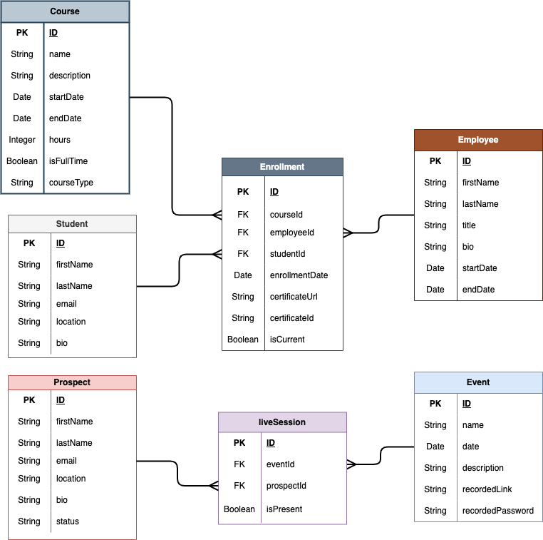

# NextGen Coders Academy

## Description
Main website for NextGen Coders Academy. Users will be able to read about the bootcamp, sign up for Q&A sessions, look at the course syllabus, read about the instructors, and more!

## Getting Started
1. Clone the repository:
```
git clone https://github.com/NextGen-Coders-Academy/website-1.0.git
cd website-1.0
```

2. Install the dependencies:
```
npm install
```

3. Setup the MongoDB database:
   a. Create a [MongoDB Atlas](https://www.mongodb.com/cloud/atlas/register) account
   b. Reach out to Eric Fithian or Troy Swayzee to be added to the NextGen Coders Academy project
   c. To create a new db user, click `Database Access`, then click `ADD NEW DATABASE USER` and follow the instructions there
   d. To setup the configuration to the website-1.0 app, click `Database` on the left hand side then click `Connect`, you should see a window pop-up. Click `Drivers` then follow the instructions

4. Confirm project is properly configured:
   a. Your project should have a `.env` file with a variable called `MONGO_DB_URI` in the root directory and should have the following code (update `<DB_USER>` and `<DB_PASSWORD>` to your MongoDB credentials):
   ```
   MONGO_DB_URI=mongodb+srv://<DB_USER>:<DB_PASSWORD>@cluster0.rdl2dfe.mongodb.net/?retryWrites=true&w=majority&appName=Cluster0&dbName=NextGen
   ```
   b. run `npm run dev` to run app

## ERD


## Technologies Used
1. Node.js: Node.js is a server-side JavaScript runtime environment that allows developers to execute JavaScript code outside the web browser. It provides a non-blocking and event-driven architecture, making it suitable for building scalable and efficient server-side applications.

2. Express.js: Express.js is a fast and minimalist web application framework for Node.js. It simplifies the process of building web applications and APIs by providing essential tools for routing, middleware, and handling HTTP requests and responses.

3. Mongoose: The Mongoose library in JavaScript is a popular Object Data Modeling (ODM) library for MongoDB and Node.js. It provides a straightforward, schema-based solution to model your application data. Mongoose offers built-in type casting, validation, query building, and business logic hooks, among other features. It allows developers to structure their data and enforce a schema on MongoDB, which is inherently schema-less, facilitating the development of more robust and scalable applications.

4. EJS (Embedded JavaScript): EJS is a simple and effective template engine for JavaScript. It enables you to embed dynamic content within HTML, making it easier to generate dynamic web pages by injecting data from your application.

## Project Structure
- config: Contains configuration file which stores the database configuration.
- controllers: Handles application logic and interacts with models.
- database/models: Defines mongoose models that represent database tables.
- server.js: The entry point of the application, sets up the server and middleware.
- views: The frontend content